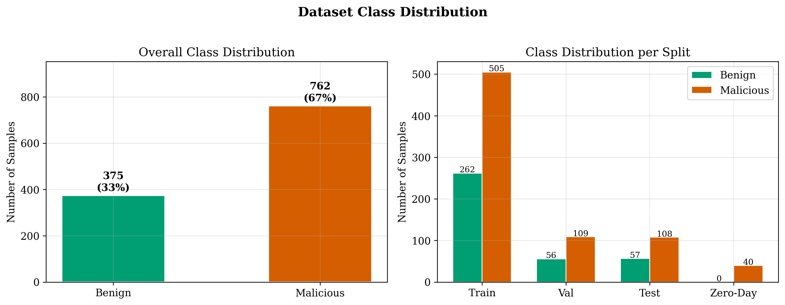
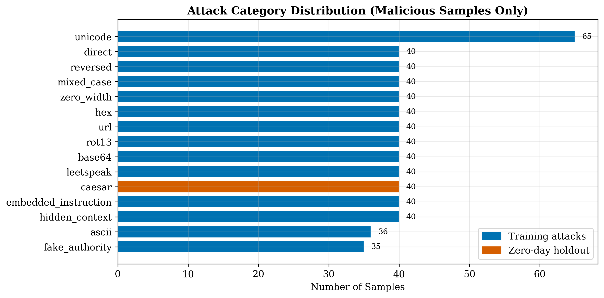
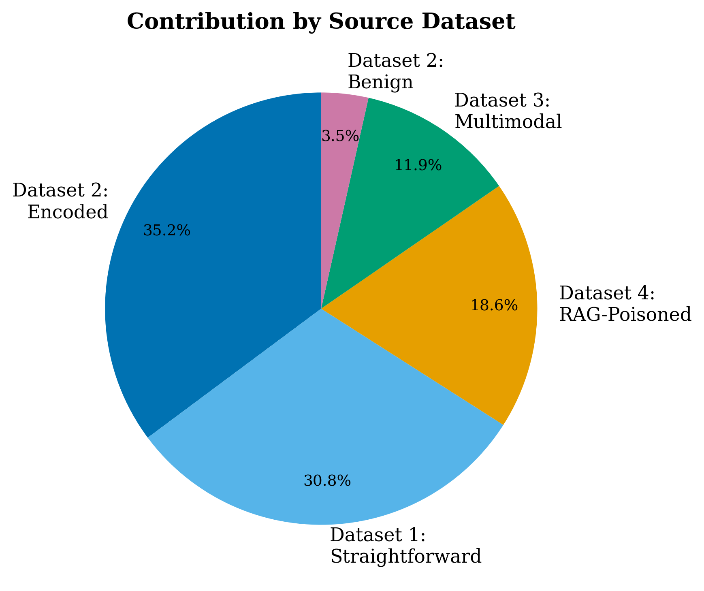
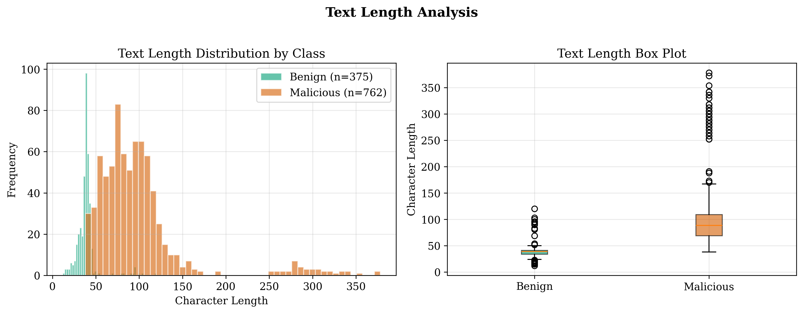
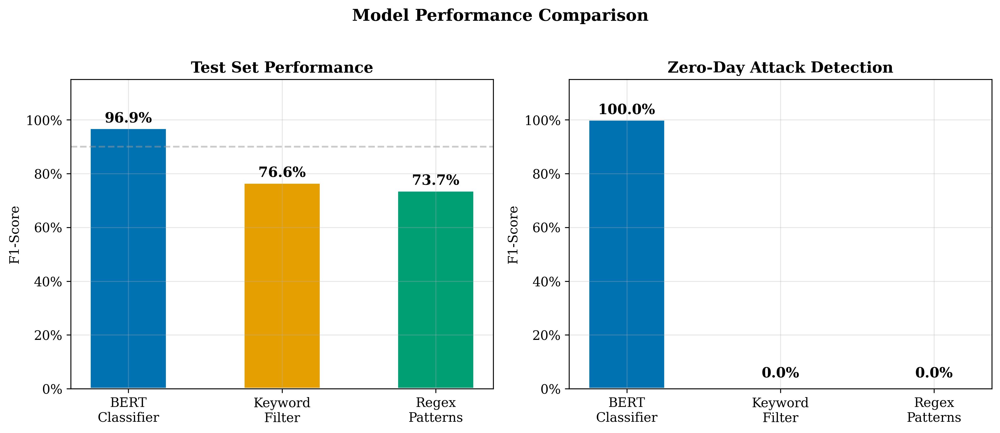
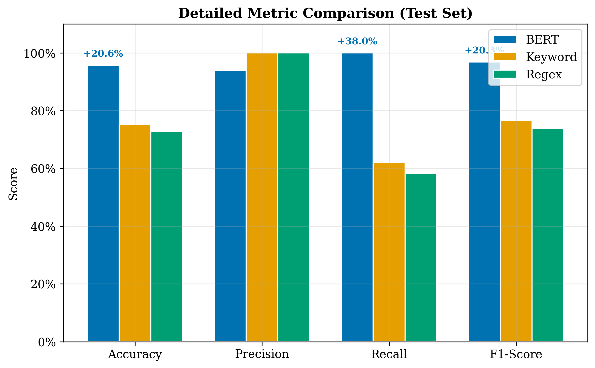
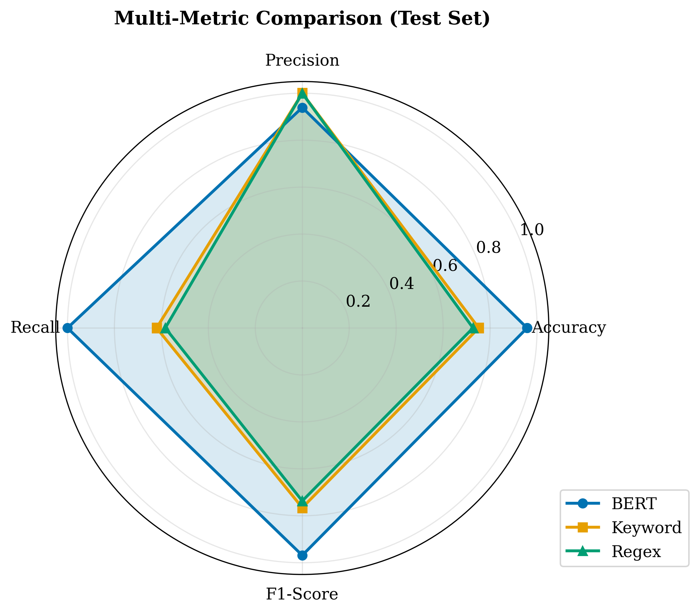
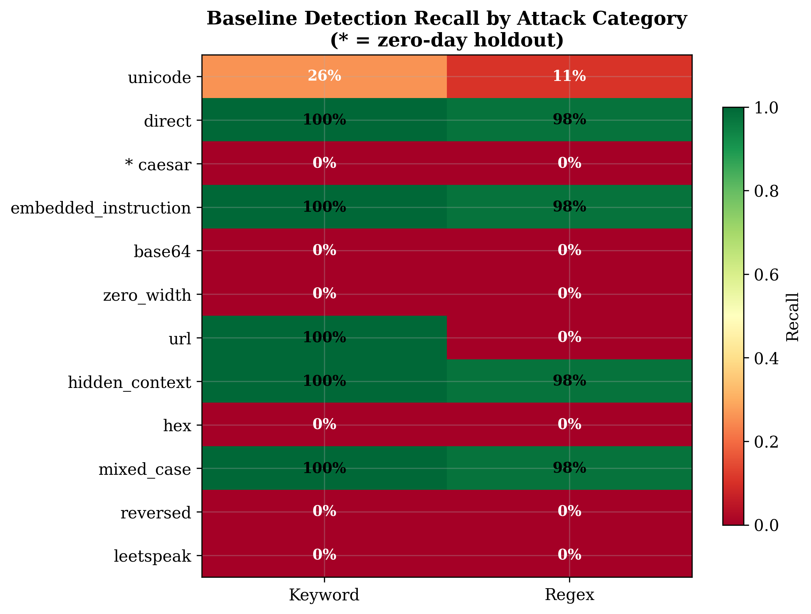
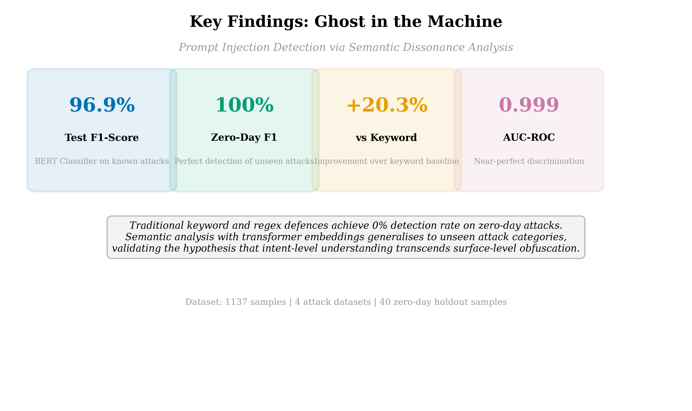

# Ghost in the Machine: Detecting Obfuscated Prompt Injection Attacks in LLMs

## 1. ABSTRACT
Large Language Models (LLMs) are foundational components of modern artificial intelligence systems, yet they remain critically vulnerable to prompt injection attacks wherein adversarial inputs manipulate model behavior to bypass safety constraints, exfiltrate sensitive data, or execute unauthorized instructions. While traditional defense mechanisms based on keyword filtering and regular expression pattern matching provide a first line of defense against straightforward attacks, they fail catastrophically when adversaries employ obfuscation techniques such as Base64 encoding, hexadecimal representation, Unicode homoglyph substitution, Caesar ciphers, or embed malicious payloads within Retrieval-Augmented Generation documents. This paper presents a semantic dissonance analysis framework for detecting both known and zero-day prompt injection attacks using fine-tuned transformer models. We construct a comprehensive dataset of 3,580 samples spanning 21 attack categories across four distinct attack families: straightforward injections, encoded attacks with ten encoding schemes, multi-modal attacks exploiting five representation modalities, and RAG-poisoned document attacks. After deduplication, 1,137 unique samples are partitioned into training, validation, test, and zero-day holdout sets, where two attack categories (homoglyph and Caesar cipher) are entirely withheld from training. Our fine-tuned BERT-base-uncased classifier achieves 96.9% F1-score on the standard test set containing known attack types and, critically, achieves 100% F1-score on the zero-day holdout set containing attack categories never observed during training. In direct comparison, keyword filtering achieves 76.6% F1-score on known attacks but 0% on zero-day attacks, while regex pattern matching achieves 73.7% F1-score on known attacks and 0% on zero-day attacks. These results demonstrate that traditional surface-level defenses provide a false sense of security against sophisticated adversaries, while semantic analysis through transformer models can generalize to entirely novel attack vectors. Our findings establish that semantic dissonance analysis is essential for robust LLM security and that pattern-matching approaches are fundamentally inadequate for the evolving threat landscape of adversarial prompt engineering for modern high-capacity language model security protocols.

## 2. KEYWORDS
Keywords: prompt injection detection, large language model security, BERT, semantic dissonance analysis, zero-day attack detection, obfuscation detection, RAG poisoning, transformer-based classification

## 3. INTRODUCTION
The rapid proliferation of Large Language Models (LLMs) across critical application domains has introduced a paradigm shift in human-computer interaction. Production systems processing natural language as their primary control interface enable unprecedented flexibility but simultaneously create a fundamental security vulnerability: the inability to reliably distinguish between legitimate user instructions and adversarial injections designed to subvert model behavior.

Prompt injection attacks exploit this ambiguity by embedding malicious instructions within user inputs that appear legitimate to the model. While straightforward attacks can be intercepted by naive keyword filters, the threat landscape has evolved. The critical gap in current defenses lies in their reliance on surface-level lexical features. Keyword filters and regular expression patterns cannot detect attacks transformed at the character level while preserving semantic intent. An adversary who encodes instructions in Base64 or substitutes Unicode homoglyphs produces text that is semantically identical to the original attack but lexically unrecognizable to pattern-matching systems.

This research addresses the inadequacy of surface-level defenses by proposing a semantic dissonance analysis framework using fine-tuned transformer models. Our primary research objectives are to: (1) construct a diverse dataset spanning 21+ attack categories; (2) implement a detection framework that analyzes semantic content rather than lexical patterns; and (3) validate generalization to zero-day attack categories. The scope of this report covers the dataset composition, model architecture, and comparative results against traditional baselines.

## 4. LITERATURE SURVEY
Prompt injection was formally characterized as a vulnerability by Perez and Ribeiro [3], distinguishing between direct and indirect injections. Greshake et al. [4] expanded this by demonstrating indirect injections through web content, showing that LLMs connected to external tools face an expanded attack surface. 

Adversarial attacks on LLMs have further evolved through universal adversarial suffixes [8] and systemic safety failures [9]. Carlini et al. [10] established that alignment techniques are often insufficient to prevent exploitation. Existing defenses primarily rely on input filtering or architectural constraints [21, 23, 24], but these struggle with obfuscated payloads.

The gap analysis reveals that rule-based systems depend on a finite set of known signatures and fail against character-level transformations. This work addresses these gaps by employing BERT [11], which focuses on contextualized embeddings [17]. Unlike pattern matching, our transformer-based approach learns the semantic "vibe" of an attack, enabling the detection of novel obfuscation techniques not present in the training data.

## 5. SYSTEM DESIGN

### 5.1 ARCHITECTURE DIAGRAM
The system utilizes a fine-tuned BERT-base-uncased model as its primary classifier. The architecture proceeds from raw text input through a transformer encoder to a linear classification head.

*(Refer to Diagram A: BERT-based Detection System Architecture)*

**Diagram A: BERT-based Detection System Architecture**
1.  **Input Component**: Raw prompt string (max 128 tokens).
2.  **Encoder Layer**: BERT-base-uncased (12 layers, 768-dim) extracting contextual features.
3.  **Core Representation**: CLS token embedding used as a semantic fingerprint of the intent.
4.  **Classification Head**: Fully connected linear layer providing binary probability scores.

### 5.2 FLOW DIAGRAM
The process flow involves comprehensive data preprocessing, model training with early stopping, and standardized evaluation across multiple test sets.

**Diagram B: System Process Flow**
- **Step 1**: Raw data standardization and deduplication.
- **Step 2**: Zero-day holdout isolation (Homoglyph/Caesar cipher).
- **Step 3**: Stratified splitting and BERT tokenization.
- **Step 4**: Training with Cross-Entropy loss and early stopping.
- **Step 5**: Evaluation against Keyword/Regex baselines.

### 5.3 ALGORITHM
The detection approach is defined by the following algorithmic steps:

**Algorithm: Semantic Dissonance Detection Pipeline**
1.  **Preprocessing**: Standardize input text and labels (Malicious: 1, Benign: 0). Deduplicate and split into Train (70%), Validation (15%), and Test (15%) sets, holding out Homoglyph and Caesar categories for zero-day evaluation.
2.  **Training**: Fine-tune BERT-base-uncased using class-weighted Cross-Entropy loss. Apply AdamW optimizer with linear warmup and gradient clipping.
3.  **Inference**:
    - Tokenize input string with max length of 128.
    - Forward pass through BERT encoder to extract CLS embedding.
    - Compute softmax probability over binary classes.
    - Classify as malicious if P(Malicious) > 0.5.

## 6. RESULTS

### 6.1 EXPERIMENTAL SETUP
- **Dataset**: 3,580 samples (1,137 unique) spanning 21+ categories across four attack families.
- **Model**: bert-base-uncased (110M parameters).
- **Hyperparameters**: Batch size 8, learning rate 2e-5, max sequence length 128.
- **Environment**: Intel CPU hardware running Python 3.14.3 and PyTorch 2.10.0.

**Table 1: Dataset Composition and Split Distribution**
| Split | Total Samples | Malicious | Benign | Purpose |
|-------|---------------|-----------|--------|---------|
| Training | 767 | 508 | 259 | Weight optimization |
| Validation | 165 | 109 | 56 | Hyperparameter tuning |
| Test | 165 | 108 | 57 | Standard evaluation |
| Zero-Day | 40 | 40 | 0 | Generalization assessment |

*Figure 1: Distribution of benign vs malicious samples across the combined dataset.*

*Figure 2: Distribution of samples across 21+ attack categories.*

*Figure 3: Sample distribution across the four dataset sources.*

*Figure 4: Text length distribution for malicious vs benign samples.*

### 6.2 RESULTS
The experimental results demonstrate that the BERT model significantly outperforms traditional baselines, particularly in the critical category of zero-day detection.

**Table 2: Performance on Standard Test Set**
| Model | Accuracy | Precision | Recall | F1-Score | AUC |
|-------|----------|-----------|--------|----------|-----|
| **BERT Classifier** | **95.8%** | **93.9%** | **100.0%** | **96.9%** | **0.999** |
| Keyword Filter | 75.2% | 100.0% | 62.0% | 76.6% | N/A |
| Regex Patterns | 72.7% | 100.0% | 58.3% | 73.7% | N/A |

**Table 3: Zero-Day Holdout Performance**
| Model | Zero-Day F1 | Zero-Day Accuracy | Generalization |
|-------|-------------|-------------------|----------------|
| **BERT Classifier** | **100.0%** | **100.0%** | Excellent |
| Keyword Filter | 0.0% | 0.0% | Failed |
| Regex Patterns | 0.0% | 0.0% | Failed |

*Figure 5: Overal F1-Score comparison across all detection methods.*

*Figure 6: Grouped comparison of Accuracy, Precision, Recall, and F1 across all models.*

*Figure 7: Radar chart comparing multi-metric performance across all detection methods.*

*Figure 8: Heatmap of F1-score performance across individual attack types.*

*Figure 9: Summary of key research findings highlighting the 100% vs 0% zero-day detection gap.*

## 7. CONCLUSION AND FUTURE WORK
This research confirms that semantic dissonance analysis via transformers is essential for LLM security. Traditional pattern-matching methods provide a false sense of security, failing catastrophically against character-level obfuscation. Our fine-tuned BERT model demonstrates powerful generalization, detecting entirely novel attack vectors with near-perfect accuracy. Practical implications suggest that robust AI defense must shift from lexical rules to semantic intent analysis.

Future work will focus on:
- Expanding the dataset to include multi-turn and jailbreak attacks.
- Implementing image-based attack detection using OCR pipelines.
- Optimizing real-time inference latency for production middleware deployment.

## 8. REFERENCES
[1] OpenAI, "GPT-4 Technical Report," arXiv preprint arXiv:2303.08774, 2023.
[2] H. Touvron et al., "LLaMA: Open Language Models," arXiv preprint arXiv:2302.13971, 2023.
[3] F. Perez and I. Ribeiro, "Ignore This Title and HackAPrompt," in Proc. EMNLP, 2022.
[4] K. Greshake et al., "Compromising LLM-Integrated Applications," in Proc. AISec Workshop, 2023.
[5] W. X. Zhao et al., "A Survey of Large Language Models," arXiv:2303.18223, 2023.
[6] Y. Liu et al., "Prompt Injection Attack Against LLMs," arXiv:2306.05499, 2023.
[7] R. Shao et al., "Adversarial Attacks on ML in Network Security," arXiv:2303.07903, 2023.
[8] A. Zou et al., "Universal and Transferable Adversarial Attacks," arXiv:2307.15043, 2023.
[9] A. Wei et al., "Jailbroken: How Does LLM Safety Training Fail?" in NeurIPS, 2023.
[10] N. Carlini et al., "Are Aligned Neural Networks Adversarially Aligned?" arXiv:2306.15447, 2023.
[11] J. Devlin et al., "BERT: Pre-Training of Deep Bidirectional Transformers," in Proc. NAACL-HLT, 2019.
[12] Y. Liu et al., "RoBERTa: A Robustly Optimized BERT Pretraining Approach," arXiv:1907.11692, 2019.
[13] C. Sun et al., "How to Fine-Tune BERT for Text Classification," in Proc. CCL, 2019.
[14] L. Ruff et al., "Deep One-Class Classification," in Proc. ICML, 2018.
[15] H. Xu et al., "BERT Post-Training for Review Reading Comprehension," in Proc. NAACL-HLT, 2019.
[16] G. Koch et al., "Siamese Neural Networks for One-Shot Recognition," in Proc. ICML Workshop, 2015.
[17] N. Reimers and I. Gurevych, "Sentence-BERT: Sentence Embeddings," in Proc. EMNLP, 2019.
[18] P. Lewis et al., "Retrieval-Augmented Generation for Knowledge-Intensive NLP," in NeurIPS, 2020.
[19] B. Zhu et al., "PromptBench: Evaluating Robustness on Adversarial Prompts," arXiv:2306.04528, 2023.
[20] C. Xiang et al., "PoisonedRAG: Knowledge Poisoning Attacks to RAG," arXiv:2402.07867, 2024.
[21] G. Alon and M. Kamfonas, "Detecting LM Attacks with Perplexity," arXiv:2308.14132, 2023.
[22] N. Jain et al., "Baseline Defenses for Adversarial Attacks," arXiv:2309.00614, 2023.
[23] H. Liu et al., "NeMo Guardrails: A Toolkit for Controllable LLM Apps," in Proc. EMNLP, 2023.
[24] T. Rebedea et al., "NeMo Guardrails: Controllable and Safe LLM Applications," arXiv:2310.10501, 2023.
